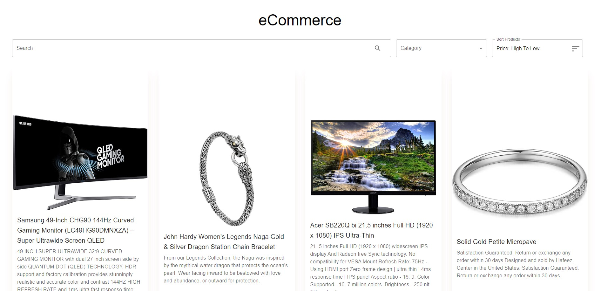

## Table of contents

- [Overview](#overview)
- [Screenshot](#screenshot)
- [Links](#links)
- [Built with](#built-with)
- [Author](#author)

## Overview
This app provides the basic homepage of an e-commerce website to browse a variety of products with a mobile-friendly UI.

### Screenshot

### Links

- Solution URL: [E-Commerce-solution](https://github.com/gharewal12/e-commerce)
- Live Site URL: [E-Commerce-Live-Url](https://gharewal12.github.io/e-commerce/)

### Built with

- Semantic HTML5 markup
- CSS custom properties
- [React](https://reactjs.org/) - React JS library
- [Typescript](https://www.typescriptlang.org/) - Typescript library
- [Material UI Components](https://mui.com/) - For styles
- GitHub pages for deployment

## Author

  

